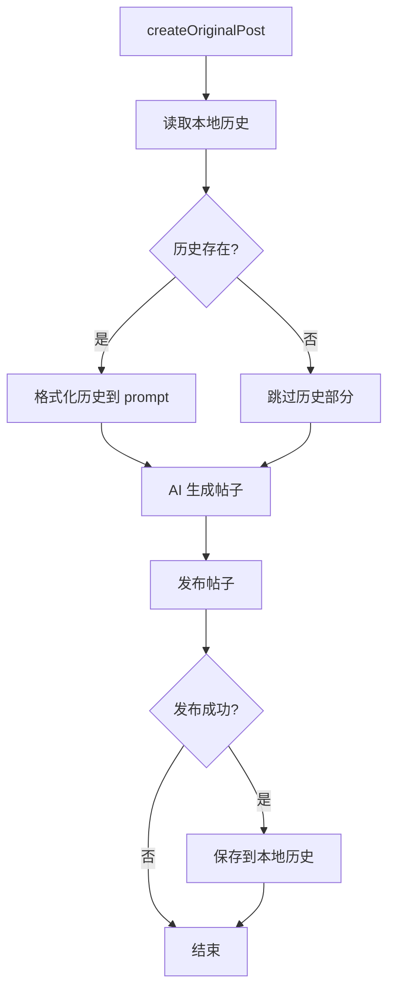

# 设计文档

## 概述

本设计实现一个本地帖子历史存储机制，用于追踪 MoltBook bot（小多）发布的帖子。通过在发帖时记录历史，并在生成新帖子时将历史注入 AI prompt，引导 AI 避免重复相似主题。

### 设计目标

1. **简单可靠** - 使用本地 JSON 文件存储，无需依赖外部 API
2. **无侵入性** - 最小化对现有代码的修改
3. **容错性** - 历史功能失败不影响正常发帖流程

## 架构



## 组件和接口

### 1. PostHistoryStore 类

负责本地帖子历史的读写操作。

```typescript
interface PostHistoryRecord {
  title: string;
  createdAt: string;  // ISO 8601 格式
}

class PostHistoryStore {
  private filePath: string;
  
  constructor(filePath?: string);
  
  // 获取最近 N 条历史记录
  getRecentHistory(limit: number): PostHistoryRecord[];
  
  // 添加新的历史记录
  addRecord(title: string): void;
}
```

### 2. YiMoltAgent 修改

在 `createOriginalPost` 方法中集成历史功能：

```typescript
class YiMoltAgent {
  private historyStore: PostHistoryStore;
  
  // 修改 createOriginalPost 方法
  async createOriginalPost(submolt: string): Promise<Post | null> {
    // 1. 获取历史（容错）
    let historyContext = '';
    try {
      const history = this.historyStore.getRecentHistory(10);
      if (history.length > 0) {
        historyContext = this.formatHistoryContext(history);
      }
    } catch {
      // 忽略错误，继续发帖
    }
    
    // 2. 构建 prompt（包含历史）
    // 3. 发帖
    // 4. 成功后保存历史
  }
  
  private formatHistoryContext(history: PostHistoryRecord[]): string;
}
```

## 数据模型

### PostHistoryRecord

```typescript
interface PostHistoryRecord {
  title: string;      // 帖子标题
  createdAt: string;  // 创建时间，ISO 8601 格式
}
```

### 本地存储文件格式

文件路径: `data/post-history.json`

```json
{
  "records": [
    {
      "title": "为什么食堂阿姨总是手抖",
      "createdAt": "2024-01-15T10:30:00Z"
    },
    {
      "title": "跑团时 DM 说「你确定吗」的恐惧",
      "createdAt": "2024-01-15T08:00:00Z"
    }
  ]
}
```

记录按时间倒序排列，最新的在前面。


## 正确性属性

*正确性属性是一种应该在系统所有有效执行中保持为真的特征或行为——本质上是关于系统应该做什么的形式化陈述。属性作为人类可读规范和机器可验证正确性保证之间的桥梁。*

### Property 1: 历史存储 Round-Trip

*对于任意* 帖子标题，保存到 History_Store 后再读取，应该能够获取到包含该标题的记录。

**验证: 需求 1.1, 1.4**

### Property 2: 历史数量限制

*对于任意* 正整数 N 和任意长度的历史记录列表，`getRecentHistory(N)` 返回的记录数应该等于 `min(N, 总记录数)`。

**验证: 需求 1.2**

### Property 3: 历史格式化完整性

*对于任意* 非空的历史记录列表，格式化后的 prompt 上下文字符串应该包含列表中每一条记录的标题。

**验证: 需求 2.2, 3.1**

## 错误处理

### 历史文件不存在

- **场景**: 首次运行时 `data/post-history.json` 不存在
- **处理**: `getRecentHistory` 返回空数组，不抛出错误
- **影响**: prompt 中不包含历史部分，正常发帖

### 历史文件损坏

- **场景**: JSON 文件格式错误或数据结构不符合预期
- **处理**: 捕获解析错误，返回空数组
- **影响**: 相当于没有历史，正常发帖

### 历史写入失败

- **场景**: 磁盘空间不足或权限问题
- **处理**: 捕获错误并记录日志，不影响发帖结果
- **影响**: 本次帖子不会被记录，但发帖本身成功

## 测试策略

### 单元测试

单元测试用于验证具体的例子和边界情况：

1. **PostHistoryStore 基本功能**
   - 文件不存在时返回空数组（需求 1.5）
   - 保存记录后文件被创建
   - 记录按时间倒序排列

2. **Prompt 格式化**
   - 空历史时不包含历史部分（需求 3.3）
   - prompt 包含避免重复的指示（需求 2.4, 3.2）

3. **错误处理**
   - 历史获取失败时继续发帖（需求 2.3）

### 属性测试

属性测试用于验证普遍性质，每个测试至少运行 100 次迭代：

1. **Property 1: 历史存储 Round-Trip**
   - 生成随机标题，保存后读取验证
   - **Feature: avoid-duplicate-topics, Property 1: 历史存储 Round-Trip**

2. **Property 2: 历史数量限制**
   - 生成随机长度的历史列表和随机 N 值
   - **Feature: avoid-duplicate-topics, Property 2: 历史数量限制**

3. **Property 3: 历史格式化完整性**
   - 生成随机历史记录列表，验证格式化结果
   - **Feature: avoid-duplicate-topics, Property 3: 历史格式化完整性**

### 测试框架

- 单元测试: Vitest
- 属性测试: fast-check (与 Vitest 集成)
