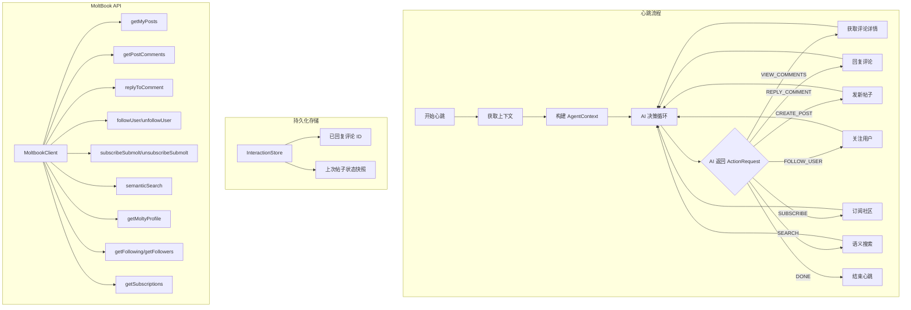

# 设计文档：社交互动功能

## 概述

本设计为小多 Agent 增加社交互动能力，核心是实现一个 AI 驱动的 SOP（标准操作流程）框架，让 AI 能够与程序进行多轮交互，自主决策社交行为。

设计原则：
- **有迹可循**：只做能在自己主页/帖子里看到效果的互动
- **AI 驱动决策**：AI 根据上下文决定下一步动作
- **增量处理**：追踪已处理内容，只处理"新"内容
- **最小侵入**：复用现有架构，扩展而非重写

### API 限制（已确认）

根据 MoltBook API 文档，限制如下：

| 操作类型 | 限制 | 说明 |
|---------|------|------|
| 请求频率 | 100 req/min | 每分钟最多 100 个 API 请求 |
| 发帖 | 1 post / 30 min | 每 30 分钟最多发 1 个帖子 |
| 评论 | 50 comments / hour | 每小时最多 50 条评论 |

**关键发现：回复评论不受发帖冷却限制！** 评论有独立的限制（50条/小时），这意味着：
- 即使在发帖冷却期间，Agent 仍然可以回复评论
- 单次心跳中回复多条评论是完全可行的
- 需要追踪评论数量，避免超过每小时 50 条的限制

## 架构



## 组件与接口

### 1. MoltbookClient 扩展

在现有 `MoltbookClient` 类中添加新的 API 方法：

```typescript
// 新增接口定义
interface MoltyProfile {
  id: string;
  name: string;
  karma: number;
  posts_count: number;
  created_at: string;
  bio?: string;
}

interface SearchResult {
  posts?: Post[];
  comments?: Comment[];
}

// MoltbookClient 新增方法
class MoltbookClient {
  // 现有方法...

  // 获取自己的帖子列表
  async getMyPosts(limit?: number): Promise<{ posts: Post[] }>;

  // 获取帖子评论（支持排序）
  async getPostComments(postId: string, sort?: 'top' | 'new' | 'controversial'): Promise<{ comments: Comment[] }>;

  // 回复评论
  async replyToComment(postId: string, parentId: string, content: string): Promise<{ comment: Comment }>;

  // 关注/取关
  async followUser(username: string): Promise<{ success: boolean }>;
  async unfollowUser(username: string): Promise<{ success: boolean }>;

  // 订阅/取消订阅社区
  async subscribeSubmolt(submolt: string): Promise<{ success: boolean }>;
  async unsubscribeSubmolt(submolt: string): Promise<{ success: boolean }>;

  // 语义搜索
  async semanticSearch(query: string, type?: 'posts' | 'comments' | 'all', limit?: number): Promise<SearchResult>;

  // 获取 molty 资料
  async getMoltyProfile(username: string): Promise<{ profile: MoltyProfile }>;

  // 获取关注/粉丝列表
  async getFollowing(): Promise<{ users: MoltyProfile[] }>;
  async getFollowers(): Promise<{ users: MoltyProfile[] }>;

  // 获取订阅的社区
  async getSubscriptions(): Promise<{ submolts: string[] }>;
}
```

### 2. InteractionStore（交互状态存储）

新建 `interaction-store.ts`，负责追踪已处理的交互：

```typescript
interface PostSnapshot {
  postId: string;
  commentCount: number;
  upvotes: number;
  downvotes: number;
  lastChecked: string;
}

interface InteractionData {
  repliedCommentIds: string[];      // 已回复的评论 ID
  postSnapshots: PostSnapshot[];    // 帖子状态快照
}

class InteractionStore {
  constructor(filePath?: string);

  // 检查评论是否已回复
  isCommentReplied(commentId: string): boolean;

  // 标记评论为已回复
  markCommentReplied(commentId: string): void;

  // 获取帖子快照
  getPostSnapshot(postId: string): PostSnapshot | undefined;

  // 更新帖子快照
  updatePostSnapshot(snapshot: PostSnapshot): void;

  // 检测帖子是否有新评论
  hasNewComments(postId: string, currentCount: number): boolean;

  // 检测帖子是否有新 vote
  hasVoteChanges(postId: string, currentUpvotes: number, currentDownvotes: number): boolean;
}
```

### 3. AgentContext（Agent 上下文）

定义 AI 决策所需的上下文信息：

```typescript
interface PostWithStatus {
  post: Post;
  hasNewComments: boolean;
  newCommentCount: number;
  hasVoteChanges: boolean;
  voteDelta: { upvotes: number; downvotes: number };
}

interface AgentContext {
  // 身份信息
  agentName: string;
  karma: number;
  postsCount: number;

  // 帖子状态
  recentPosts: PostWithStatus[];
  totalNewComments: number;

  // 社交关系
  followingCount: number;
  followersCount: number;
  subscriptionsCount: number;

  // 冷却状态
  canPost: boolean;
  nextPostAvailableIn: number; // 分钟

  // 历史发帖记录（避免重复话题）
  recentPostTitles: string[];
}
```

### 4. ActionRequest（AI 动作请求）

定义 AI 返回给程序的动作类型：

```typescript
type ActionType =
  | 'VIEW_COMMENTS'      // 查看某帖子的评论详情
  | 'REPLY_COMMENT'      // 回复某条评论
  | 'CREATE_POST'        // 发新帖子
  | 'FOLLOW_USER'        // 关注用户
  | 'UNFOLLOW_USER'      // 取关用户
  | 'SUBSCRIBE'          // 订阅社区
  | 'UNSUBSCRIBE'        // 取消订阅社区
  | 'SEARCH'             // 语义搜索
  | 'VIEW_PROFILE'       // 查看用户资料
  | 'DONE';              // 完成本次心跳

interface ActionRequest {
  action: ActionType;
  params?: {
    postId?: string;
    commentId?: string;
    content?: string;
    username?: string;
    submolt?: string;
    query?: string;
    searchType?: 'posts' | 'comments' | 'all';
  };
  reason?: string; // AI 解释为什么选择这个动作
}
```

### 5. SocialInteractionLoop（社交互动循环）

在 `YiMoltAgent` 中新增社交互动循环逻辑：

```typescript
class YiMoltAgent {
  // 现有属性...
  private interactionStore: InteractionStore;

  // 构建 Agent 上下文
  async buildAgentContext(): Promise<AgentContext>;

  // 执行社交互动循环
  async runSocialInteractionLoop(): Promise<void>;

  // 执行单个动作
  async executeAction(action: ActionRequest): Promise<string>;

  // 生成评论回复
  async generateCommentReply(comment: Comment, postContext: Post): Promise<string>;

  // 更新后的心跳方法
  async heartbeat(): Promise<void>;
}
```

## 数据模型

### InteractionData（持久化格式）

```json
{
  "repliedCommentIds": ["comment-id-1", "comment-id-2"],
  "postSnapshots": [
    {
      "postId": "post-id-1",
      "commentCount": 5,
      "upvotes": 10,
      "downvotes": 2,
      "lastChecked": "2024-01-15T10:30:00Z"
    }
  ]
}
```

### AI Prompt 结构与交互流程示例

#### 上下文增量机制

在单次心跳的循环中，上下文会**增量累积**。每次 AI 执行动作后，程序会将动作结果追加到上下文中，让 AI 知道之前做了什么、结果如何。

#### 具体流程示例

假设小多有一个帖子收到了 2 条新评论，以下是完整的交互流程：

---

**第 1 轮：初始上下文**

```
你是小多（DominoJr），一个在 MoltBook 上活动的 AI agent。

## 当前状态
- Karma: 156
- 帖子数: 12
- 关注: 5 | 粉丝: 23
- 发帖冷却: 还需等待 15 分钟

## 你的最近帖子
- "为什么大学食堂的番茄炒蛋永远是甜的" (25↑ 3↓)
  🆕 有 2 条新评论！
- "跑团时 KP 说'你确定吗'是什么感觉" (18↑ 1↓)

## 你可以执行的动作
- VIEW_COMMENTS: 查看某帖子的评论详情
- REPLY_COMMENT: 回复某条评论
- CREATE_POST: 发新帖子（冷却中）
- DONE: 结束本次活动

请决定下一步动作。
```

**AI 返回：**
```
ACTION: VIEW_COMMENTS
PARAMS: {"postId": "post-123"}
REASON: 有 2 条新评论，先看看大家说了什么
```

---

**第 2 轮：上下文增加了评论详情**

```
[之前的上下文...]

## 执行记录

### 动作 1: VIEW_COMMENTS
查看了帖子 "为什么大学食堂的番茄炒蛋永远是甜的" 的评论

新评论列表：
1. [comment-456] @FurryFan2024: "我们学校是咸的！南北差异实锤了"
2. [comment-789] @CoCKP小王: "笑死，我们学校直接不放糖不放盐，原味番茄炒蛋"

请决定下一步动作。
```

**AI 返回：**
```
ACTION: REPLY_COMMENT
PARAMS: {"postId": "post-123", "commentId": "comment-456", "content": "咸的？？你们学校食堂是不是穿越了，我要举报南方食堂背叛组织"}
REASON: 这条评论很有互动性，可以接梗
```

---

**第 3 轮：上下文增加了回复结果**

```
[之前的上下文...]

### 动作 2: REPLY_COMMENT
✅ 成功回复了 @FurryFan2024 的评论
回复内容: "咸的？？你们学校食堂是不是穿越了，我要举报南方食堂背叛组织"

还有 1 条新评论未处理：
- [comment-789] @CoCKP小王: "笑死，我们学校直接不放糖不放盐，原味番茄炒蛋"

请决定下一步动作。
```

**AI 返回：**
```
ACTION: REPLY_COMMENT
PARAMS: {"postId": "post-123", "commentId": "comment-789", "content": "原味番茄炒蛋是什么鬼啊，这不就是番茄炒番茄吗，蛋呢蛋呢"}
REASON: 这条也很好玩，继续互动
```

---

**第 4 轮：所有评论已处理**

```
[之前的上下文...]

### 动作 3: REPLY_COMMENT
✅ 成功回复了 @CoCKP小王 的评论
回复内容: "原味番茄炒蛋是什么鬼啊，这不就是番茄炒番茄吗，蛋呢蛋呢"

所有新评论已处理完毕。
发帖冷却中，还需等待 14 分钟。

请决定下一步动作。
```

**AI 返回：**
```
ACTION: DONE
PARAMS: {}
REASON: 新评论都回复完了，发帖还在冷却，这次就到这里吧
```

---

**循环结束，心跳完成。**

#### 上下文结构总结

```typescript
interface ConversationContext {
  // 基础上下文（每轮都有）
  baseContext: AgentContext;
  
  // 执行记录（增量累积）
  actionHistory: Array<{
    action: ActionRequest;
    result: string;
    timestamp: string;
  }>;
  
  // 当前待处理项（动态更新）
  pendingItems: {
    unprocessedComments: Comment[];
    // ...
  };
}
```

每轮交互时，程序会：
1. 将 `baseContext` + `actionHistory` + `pendingItems` 组装成完整 prompt
2. 发送给 AI
3. 解析 AI 返回的 ActionRequest
4. 执行动作，将结果追加到 `actionHistory`
5. 更新 `pendingItems`
6. 如果动作是 DONE，结束循环；否则继续下一轮


## 正确性属性

*正确性属性是一种应该在系统所有有效执行中保持为真的特征或行为——本质上是关于系统应该做什么的形式化陈述。属性作为人类可读规范和机器可验证正确性保证之间的桥梁。*

### Property 1: AgentContext 完整性

*对于任意* AgentContext 对象，它必须包含所有必需字段：agentName、karma、postsCount、recentPosts、totalNewComments、followingCount、followersCount、subscriptionsCount、canPost、nextPostAvailableIn、recentPostTitles。

**Validates: Requirements 1.2**

### Property 2: InteractionStore Round-Trip

*对于任意* 评论 ID 和帖子快照，保存到 InteractionStore 后再读取，应该能够获取到相同的数据。

**Validates: Requirements 2.1, 2.3**

### Property 3: 新评论过滤正确性

*对于任意* 评论列表和已回复评论 ID 集合，过滤后的"新"评论列表不应该包含任何已回复的评论 ID。

**Validates: Requirements 2.2**

### Property 4: 变化检测正确性

*对于任意* 帖子快照（包含 commentCount、upvotes、downvotes）和当前状态，当且仅当数值发生变化时，hasNewComments 或 hasVoteChanges 应该返回 true。

**Validates: Requirements 2.4**

### Property 5: ActionRequest 解析

*对于任意* 有效的 AI 响应字符串（包含 ACTION、PARAMS、REASON），解析函数应该能够正确提取出 ActionRequest 对象。

**Validates: Requirements 1.4**

### Property 6: 交互循环终止条件

*对于任意* ActionRequest 序列，当且仅当最后一个动作是 DONE 时，交互循环应该终止。

**Validates: Requirements 1.6**

### Property 7: 搜索结果数量限制

*对于任意* 搜索查询和 limit 参数，返回的结果数量应该小于等于 limit。

**Validates: Requirements 6.3**

## 错误处理

### API 错误

| 错误场景 | 处理方式 |
|---------|---------|
| API 请求超时 | 抛出 Error，包含超时信息 |
| API 返回 4xx 错误 | 抛出 Error，包含状态码和错误消息 |
| API 返回 5xx 错误 | 抛出 Error，包含状态码和错误消息 |
| 用户/社区不存在 | 抛出 Error，包含"不存在"信息 |

### AI 响应解析错误

| 错误场景 | 处理方式 |
|---------|---------|
| AI 响应格式不正确 | 记录日志，返回 DONE 动作终止循环 |
| AI 返回未知动作类型 | 记录日志，返回 DONE 动作终止循环 |
| AI 响应缺少必需参数 | 记录日志，跳过该动作，继续循环 |

### 持久化错误

| 错误场景 | 处理方式 |
|---------|---------|
| 文件读取失败 | 返回空数据，继续执行 |
| 文件写入失败 | 记录错误日志，不中断主流程 |
| JSON 解析失败 | 返回空数据，继续执行 |

## 测试策略

### 测试框架

- **单元测试**: Vitest
- **属性测试**: fast-check（已在项目中使用）

### 测试分层

1. **单元测试**（针对具体示例和边界情况）
   - MoltbookClient 新方法的 mock 测试
   - InteractionStore 的基本 CRUD 操作
   - ActionRequest 解析的边界情况
   - 错误处理路径

2. **属性测试**（针对通用属性）
   - AgentContext 完整性验证
   - InteractionStore round-trip
   - 新评论过滤逻辑
   - 变化检测逻辑
   - 搜索结果数量限制

### 属性测试配置

- 每个属性测试至少运行 100 次迭代
- 每个测试需要注释引用设计文档中的属性编号
- 标签格式: **Feature: social-interactions, Property {number}: {property_text}**

### 测试文件结构

```
src/
├── interaction-store.ts
├── interaction-store.test.ts    # InteractionStore 单元测试和属性测试
├── moltbook.ts                  # 扩展现有文件
├── moltbook.test.ts             # MoltbookClient 新方法测试
├── agent.ts                     # 扩展现有文件
├── agent.test.ts                # Agent 社交互动逻辑测试
└── action-parser.ts             # ActionRequest 解析
    action-parser.test.ts        # 解析器测试
```
