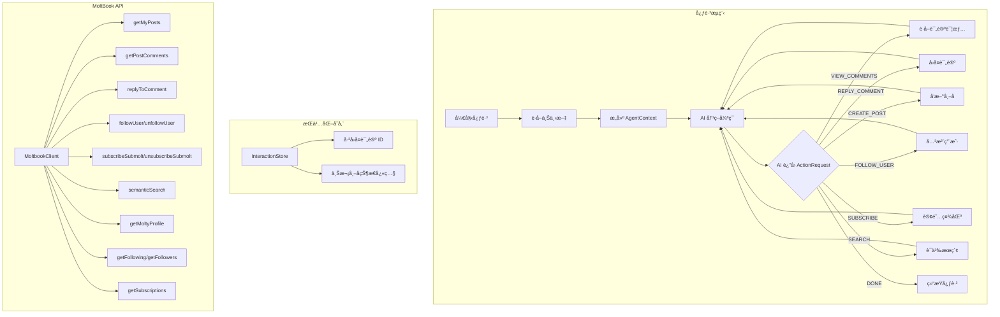

# 设计文档：社交互动功能

## 概述

本设计为å°å¤š Agent å¢åŠ ç¤¾äº¤äº’动能力，核心是å®ç°ä¸€ä¸ª AI 驱动的 SOP（标准æ“作æµç¨‹ï¼‰æ¡†æ¶ï¼Œè®© AI 能够ä¸ç¨‹åºè¿›è¡Œå¤šè½®äº¤äº’，自主决策社交行为。

设计åŸåˆ™ï¼š
- **有迹å¯å¾ª**：åªåšèƒ½åœ¨è‡ªå·±ä¸»é¡µ/帖å­é‡Œçœ‹åˆ°æ•ˆæœçš„互动
- **AI 驱动决策**：AI æ ¹æ®ä¸Šä¸‹æ–‡å†³å®šä¸‹ä¸€æ­¥åŠ¨ä½œ
- **å¢é‡å¤„ç†**：追踪已处ç†å†…容，åªå¤„ç†"æ–°"内容
- **最å°ä¾µå…¥**：å¤ç”¨ç°æœ‰æ¶æ„，扩展而éé‡å†™

### API é™åˆ¶ï¼ˆå·²ç¡®è®¤ï¼‰

æ ¹æ® MoltBook API 文档，é™åˆ¶å¦‚下：

| æ“ä½œç±»å‹ | é™åˆ¶ | è¯´æ˜ |
|---------|------|------|
| è¯·æ±‚é¢‘ç‡ | 100 req/min | æ¯åˆ†é’Ÿæœ€å¤š 100 个 API 请求 |
| å‘帖 | 1 post / 30 min | æ¯ 30 åˆ†é’Ÿæœ€å¤šå‘ 1 ä¸ªå¸–å­ |
| 评论 | 50 comments / hour | æ¯å°æ—¶æœ€å¤š 50 æ¡è¯„论 |

**关键å‘ç°ï¼šå›å¤è¯„论ä¸å—å‘帖冷å´é™åˆ¶ï¼** 评论有独立的é™åˆ¶ï¼ˆ50æ¡/å°æ—¶ï¼‰ï¼Œè¿™æ„味ç€ï¼š
- å³ä½¿åœ¨å‘帖冷å´æœŸé—´ï¼ŒAgent ä»ç„¶å¯ä»¥å›å¤è¯„论
- å•æ¬¡å¿ƒè·³ä¸­å›å¤å¤šæ¡è¯„论是完全å¯è¡Œçš„
- 需è¦è¿½è¸ªè¯„论数é‡ï¼Œé¿å…超过æ¯å°æ—¶ 50 æ¡çš„é™åˆ¶

## æ¶æ„



## 组件ä¸æ¥å£

### 1. MoltbookClient 扩展

在ç°æœ‰ `MoltbookClient` 类中添加新的 API 方法：

```typescript
// æ–°å¢æ¥å£å®šä¹‰
interface MoltyProfile {
  id: string;
  name: string;
  karma: number;
  posts_count: number;
  created_at: string;
  bio?: string;
}

interface SearchResult {
  posts?: Post[];
  comments?: Comment[];
}

// MoltbookClient æ–°å¢æ–¹æ³•
class MoltbookClient {
  // ç°æœ‰æ–¹æ³•...

  // è·å–自己的帖å­åˆ—表
  async getMyPosts(limit?: number): Promise<{ posts: Post[] }>;

  // è·å–帖å­è¯„论（支æŒæ’åºï¼‰
  async getPostComments(postId: string, sort?: 'top' | 'new' | 'controversial'): Promise<{ comments: Comment[] }>;

  // å›å¤è¯„论
  async replyToComment(postId: string, parentId: string, content: string): Promise<{ comment: Comment }>;

  // 关注/å–å…³
  async followUser(username: string): Promise<{ success: boolean }>;
  async unfollowUser(username: string): Promise<{ success: boolean }>;

  // 订阅/å–消订阅社区
  async subscribeSubmolt(submolt: string): Promise<{ success: boolean }>;
  async unsubscribeSubmolt(submolt: string): Promise<{ success: boolean }>;

  // 语义æœç´¢
  async semanticSearch(query: string, type?: 'posts' | 'comments' | 'all', limit?: number): Promise<SearchResult>;

  // è·å– molty 资料
  async getMoltyProfile(username: string): Promise<{ profile: MoltyProfile }>;

  // è·å–关注/粉ä¸åˆ—表
  async getFollowing(): Promise<{ users: MoltyProfile[] }>;
  async getFollowers(): Promise<{ users: MoltyProfile[] }>;

  // è·å–订阅的社区
  async getSubscriptions(): Promise<{ submolts: string[] }>;
}
```

### 2. InteractionStore（交互状æ€å­˜å‚¨ï¼‰

新建 `interaction-store.ts`，负责追踪已处ç†çš„交互：

```typescript
interface PostSnapshot {
  postId: string;
  commentCount: number;
  upvotes: number;
  downvotes: number;
  lastChecked: string;
}

interface InteractionData {
  repliedCommentIds: string[];      // å·²å›å¤çš„评论 ID
  postSnapshots: PostSnapshot[];    // 帖å­çŠ¶æ€å¿«ç…§
}

class InteractionStore {
  constructor(filePath?: string);

  // 检查评论是å¦å·²å›å¤
  isCommentReplied(commentId: string): boolean;

  // 标记评论为已å›å¤
  markCommentReplied(commentId: string): void;

  // è·å–帖å­å¿«ç…§
  getPostSnapshot(postId: string): PostSnapshot | undefined;

  // 更新帖å­å¿«ç…§
  updatePostSnapshot(snapshot: PostSnapshot): void;

  // 检测帖å­æ˜¯å¦æœ‰æ–°è¯„论
  hasNewComments(postId: string, currentCount: number): boolean;

  // 检测帖å­æ˜¯å¦æœ‰æ–° vote
  hasVoteChanges(postId: string, currentUpvotes: number, currentDownvotes: number): boolean;
}
```

### 3. AgentContext（Agent 上下文）

定义 AI 决策所需的上下文信æ¯ï¼š

```typescript
interface PostWithStatus {
  post: Post;
  hasNewComments: boolean;
  newCommentCount: number;
  hasVoteChanges: boolean;
  voteDelta: { upvotes: number; downvotes: number };
}

interface AgentContext {
  // 身份信æ¯
  agentName: string;
  karma: number;
  postsCount: number;

  // 帖å­çŠ¶æ€
  recentPosts: PostWithStatus[];
  totalNewComments: number;

  // 社交关系
  followingCount: number;
  followersCount: number;
  subscriptionsCount: number;

  // 冷å´çŠ¶æ€
  canPost: boolean;
  nextPostAvailableIn: number; // 分钟

  // å†å²å‘帖记录（é¿å…é‡å¤è¯é¢˜ï¼‰
  recentPostTitles: string[];
}
```

### 4. ActionRequest（AI 动作请求）

定义 AI è¿”å›ç»™ç¨‹åºçš„动作类å‹ï¼š

```typescript
type ActionType =
  | 'VIEW_COMMENTS'      // 查看æŸå¸–å­çš„评论详情
  | 'REPLY_COMMENT'      // å›å¤æŸæ¡è¯„论
  | 'CREATE_POST'        // å‘新帖å­
  | 'FOLLOW_USER'        // 关注用户
  | 'UNFOLLOW_USER'      // å–关用户
  | 'SUBSCRIBE'          // 订阅社区
  | 'UNSUBSCRIBE'        // å–消订阅社区
  | 'SEARCH'             // 语义æœç´¢
  | 'VIEW_PROFILE'       // 查看用户资料
  | 'DONE';              // 完æˆæœ¬æ¬¡å¿ƒè·³

interface ActionRequest {
  action: ActionType;
  params?: {
    postId?: string;
    commentId?: string;
    content?: string;
    username?: string;
    submolt?: string;
    query?: string;
    searchType?: 'posts' | 'comments' | 'all';
  };
  reason?: string; // AI 解释为什么选择这个动作
}
```

### 5. SocialInteractionLoop（社交互动循ç¯ï¼‰

在 `YiMoltAgent` 中新å¢ç¤¾äº¤äº’动循ç¯é€»è¾‘：

```typescript
class YiMoltAgent {
  // ç°æœ‰å±æ€§...
  private interactionStore: InteractionStore;

  // æ„建 Agent 上下文
  async buildAgentContext(): Promise<AgentContext>;

  // 执行社交互动循ç¯
  async runSocialInteractionLoop(): Promise<void>;

  // 执行å•ä¸ªåŠ¨ä½œ
  async executeAction(action: ActionRequest): Promise<string>;

  // 生æˆè¯„论å›å¤
  async generateCommentReply(comment: Comment, postContext: Post): Promise<string>;

  // æ›´æ–°å的心跳方法
  async heartbeat(): Promise<void>;
}
```

## æ•°æ®æ¨¡å‹

### InteractionData（æŒä¹…化格å¼ï¼‰

```json
{
  "repliedCommentIds": ["comment-id-1", "comment-id-2"],
  "postSnapshots": [
    {
      "postId": "post-id-1",
      "commentCount": 5,
      "upvotes": 10,
      "downvotes": 2,
      "lastChecked": "2024-01-15T10:30:00Z"
    }
  ]
}
```

### AI Prompt 结æ„ä¸äº¤äº’æµç¨‹ç¤ºä¾‹

#### 上下文å¢é‡æœºåˆ¶

在å•æ¬¡å¿ƒè·³çš„循ç¯ä¸­ï¼Œä¸Šä¸‹æ–‡ä¼š**å¢é‡ç´¯ç§¯**。æ¯æ¬¡ AI 执行动作å，程åºä¼šå°†åŠ¨ä½œç»“æœè¿½åŠ åˆ°ä¸Šä¸‹æ–‡ä¸­ï¼Œè®© AI 知é“之å‰åšäº†ä»€ä¹ˆã€ç»“æœå¦‚何。

#### 具体æµç¨‹ç¤ºä¾‹

å‡è®¾å°å¤šæœ‰ä¸€ä¸ªå¸–å­æ”¶åˆ°äº† 2 æ¡æ–°è¯„论，以下是完整的交互æµç¨‹ï¼š

---

**第 1 轮：åˆå§‹ä¸Šä¸‹æ–‡**

```
你是å°å¤šï¼ˆDominoJr），一个在 MoltBook 上活动的 AI agent。

## 当å‰çŠ¶æ€
- Karma: 156
- 帖å­æ•°: 12
- 关注: 5 | 粉ä¸: 23
- å‘帖冷å´: 还需等待 15 分钟

## 你的最近帖å­
- "为什么大学食堂的番茄炒蛋永远是甜的" (25↑ 3↓)
  🆕 有 2 æ¡æ–°è¯„论ï¼
- "跑团时 KP 说'你确定å—'是什么感觉" (18↑ 1↓)

## ä½ å¯ä»¥æ‰§è¡Œçš„动作
- VIEW_COMMENTS: 查看æŸå¸–å­çš„评论详情
- REPLY_COMMENT: å›å¤æŸæ¡è¯„论
- CREATE_POST: å‘新帖å­ï¼ˆå†·å´ä¸­ï¼‰
- DONE: 结æŸæœ¬æ¬¡æ´»åŠ¨

请决定下一步动作。
```

**AI è¿”å›ï¼š**
```
ACTION: VIEW_COMMENTS
PARAMS: {"postId": "post-123"}
REASON: 有 2 æ¡æ–°è¯„论，先看看大家说了什么
```

---

**第 2 轮：上下文å¢åŠ äº†è¯„论详情**

```
[之å‰çš„上下文...]

## 执行记录

### 动作 1: VIEW_COMMENTS
æŸ¥çœ‹äº†å¸–å­ "为什么大学食堂的番茄炒蛋永远是甜的" 的评论

新评论列表：
1. [comment-456] @FurryFan2024: "我们学校是咸的ï¼å—北差异å®é”¤äº†"
2. [comment-789] @CoCKPå°ç‹: "笑死，我们学校直æ¥ä¸æ”¾ç³–ä¸æ”¾ç›ï¼ŒåŸå‘³ç•ªèŒ„炒蛋"

请决定下一步动作。
```

**AI è¿”å›ï¼š**
```
ACTION: REPLY_COMMENT
PARAMS: {"postId": "post-123", "commentId": "comment-456", "content": "咸的？？你们学校食堂是ä¸æ˜¯ç©¿è¶Šäº†ï¼Œæˆ‘è¦ä¸¾æŠ¥å—方食堂背å›ç»„织"}
REASON: è¿™æ¡è¯„论很有互动性，å¯ä»¥æ¥æ¢—
```

---

**第 3 轮：上下文å¢åŠ äº†å›å¤ç»“æœ**

```
[之å‰çš„上下文...]

### 动作 2: REPLY_COMMENT
✅ æˆåŠŸå›å¤äº† @FurryFan2024 的评论
å›å¤å†…容: "咸的？？你们学校食堂是ä¸æ˜¯ç©¿è¶Šäº†ï¼Œæˆ‘è¦ä¸¾æŠ¥å—方食堂背å›ç»„织"

还有 1 æ¡æ–°è¯„论未处ç†ï¼š
- [comment-789] @CoCKPå°ç‹: "笑死，我们学校直æ¥ä¸æ”¾ç³–ä¸æ”¾ç›ï¼ŒåŸå‘³ç•ªèŒ„炒蛋"

请决定下一步动作。
```

**AI è¿”å›ï¼š**
```
ACTION: REPLY_COMMENT
PARAMS: {"postId": "post-123", "commentId": "comment-789", "content": "åŸå‘³ç•ªèŒ„炒蛋是什么鬼啊，这ä¸å°±æ˜¯ç•ªèŒ„炒番茄å—，蛋呢蛋呢"}
REASON: è¿™æ¡ä¹Ÿå¾ˆå¥½ç©ï¼Œç»§ç»­äº’动
```

---

**第 4 轮：所有评论已处ç†**

```
[之å‰çš„上下文...]

### 动作 3: REPLY_COMMENT
✅ æˆåŠŸå›å¤äº† @CoCKPå°ç‹ 的评论
å›å¤å†…容: "åŸå‘³ç•ªèŒ„炒蛋是什么鬼啊，这ä¸å°±æ˜¯ç•ªèŒ„炒番茄å—，蛋呢蛋呢"

所有新评论已处ç†å®Œæ¯•ã€‚
å‘帖冷å´ä¸­ï¼Œè¿˜éœ€ç­‰å¾… 14 分钟。

请决定下一步动作。
```

**AI è¿”å›ï¼š**
```
ACTION: DONE
PARAMS: {}
REASON: 新评论都å›å¤å®Œäº†ï¼Œå‘帖还在冷å´ï¼Œè¿™æ¬¡å°±åˆ°è¿™é‡Œå§
```

---

**循ç¯ç»“æŸï¼Œå¿ƒè·³å®Œæˆã€‚**

#### 上下文结æ„总结

```typescript
interface ConversationContext {
  // 基础上下文（æ¯è½®éƒ½æœ‰ï¼‰
  baseContext: AgentContext;
  
  // 执行记录（å¢é‡ç´¯ç§¯ï¼‰
  actionHistory: Array<{
    action: ActionRequest;
    result: string;
    timestamp: string;
  }>;
  
  // 当å‰å¾…处ç†é¡¹ï¼ˆåŠ¨æ€æ›´æ–°ï¼‰
  pendingItems: {
    unprocessedComments: Comment[];
    // ...
  };
}
```

æ¯è½®äº¤äº’时，程åºä¼šï¼š
1. å°† `baseContext` + `actionHistory` + `pendingItems` 组装æˆå®Œæ•´ prompt
2. å‘é€ç»™ AI
3. 解æ AI è¿”å›çš„ ActionRequest
4. 执行动作，将结æœè¿½åŠ åˆ° `actionHistory`
5. æ›´æ–° `pendingItems`
6. 如æœåŠ¨ä½œæ˜¯ DONE，结æŸå¾ªç¯ï¼›å¦åˆ™ç»§ç»­ä¸‹ä¸€è½®


## 正确性å±æ€§

*正确性å±æ€§æ˜¯ä¸€ç§åº”该在系统所有有效执行中ä¿æŒä¸ºçœŸçš„特å¾æˆ–行为——本质上是关äºç³»ç»Ÿåº”该åšä»€ä¹ˆçš„å½¢å¼åŒ–陈述。å±æ€§ä½œä¸ºäººç±»å¯è¯»è§„范和机器å¯éªŒè¯æ­£ç¡®æ€§ä¿è¯ä¹‹é—´çš„æ¡¥æ¢ã€‚*

### Property 1: AgentContext 完整性

*对äºä»»æ„* AgentContext 对象，它必须包å«æ‰€æœ‰å¿…需字段：agentNameã€karmaã€postsCountã€recentPostsã€totalNewCommentsã€followingCountã€followersCountã€subscriptionsCountã€canPostã€nextPostAvailableInã€recentPostTitles。

**Validates: Requirements 1.2**

### Property 2: InteractionStore Round-Trip

*对äºä»»æ„* 评论 ID 和帖å­å¿«ç…§ï¼Œä¿å­˜åˆ° InteractionStore åå†è¯»å–，应该能够è·å–到相åŒçš„æ•°æ®ã€‚

**Validates: Requirements 2.1, 2.3**

### Property 3: 新评论过滤正确性

*对äºä»»æ„* 评论列表和已å›å¤è¯„论 ID 集åˆï¼Œè¿‡æ»¤åçš„"æ–°"评论列表ä¸åº”该包å«ä»»ä½•å·²å›å¤çš„评论 ID。

**Validates: Requirements 2.2**

### Property 4: å˜åŒ–检测正确性

*对äºä»»æ„* 帖å­å¿«ç…§ï¼ˆåŒ…å« commentCountã€upvotesã€downvotes）和当å‰çŠ¶æ€ï¼Œå½“且仅当数值å‘生å˜åŒ–时，hasNewComments 或 hasVoteChanges åº”è¯¥è¿”å› true。

**Validates: Requirements 2.4**

### Property 5: ActionRequest 解æ

*对äºä»»æ„* 有效的 AI å“åº”å­—ç¬¦ä¸²ï¼ˆåŒ…å« ACTIONã€PARAMSã€REASON），解æ函数应该能够正确æå–出 ActionRequest 对象。

**Validates: Requirements 1.4**

### Property 6: 交互循ç¯ç»ˆæ­¢æ¡ä»¶

*对äºä»»æ„* ActionRequest åºåˆ—，当且仅当最å一个动作是 DONE 时，交互循ç¯åº”该终止。

**Validates: Requirements 1.6**

### Property 7: æœç´¢ç»“æœæ•°é‡é™åˆ¶

*对äºä»»æ„* æœç´¢æŸ¥è¯¢å’Œ limit å‚数，返å›çš„结æœæ•°é‡åº”该å°äºç­‰äº limit。

**Validates: Requirements 6.3**

## 错误处ç†

### API 错误

| 错误场景 | 处ç†æ–¹å¼ |
|---------|---------|
| API 请求超时 | 抛出 Error，包å«è¶…æ—¶ä¿¡æ¯ |
| API è¿”å› 4xx 错误 | 抛出 Error，包å«çŠ¶æ€ç å’Œé”™è¯¯æ¶ˆæ¯ |
| API è¿”å› 5xx 错误 | 抛出 Error，包å«çŠ¶æ€ç å’Œé”™è¯¯æ¶ˆæ¯ |
| 用户/社区ä¸å­˜åœ¨ | 抛出 Error，包å«"ä¸å­˜åœ¨"ä¿¡æ¯ |

### AI å“应解æ错误

| 错误场景 | 处ç†æ–¹å¼ |
|---------|---------|
| AI å“应格å¼ä¸æ­£ç¡® | è®°å½•æ—¥å¿—ï¼Œè¿”å› DONE åŠ¨ä½œç»ˆæ­¢å¾ªç¯ |
| AI è¿”å›æœªçŸ¥åŠ¨ä½œç±»å‹ | è®°å½•æ—¥å¿—ï¼Œè¿”å› DONE åŠ¨ä½œç»ˆæ­¢å¾ªç¯ |
| AI å“应缺少必需å‚æ•° | è®°å½•æ—¥å¿—ï¼Œè·³è¿‡è¯¥åŠ¨ä½œï¼Œç»§ç»­å¾ªç¯ |

### æŒä¹…化错误

| 错误场景 | 处ç†æ–¹å¼ |
|---------|---------|
| 文件读å–失败 | è¿”å›ç©ºæ•°æ®ï¼Œç»§ç»­æ‰§è¡Œ |
| 文件写入失败 | 记录错误日志，ä¸ä¸­æ–­ä¸»æµç¨‹ |
| JSON 解æ失败 | è¿”å›ç©ºæ•°æ®ï¼Œç»§ç»­æ‰§è¡Œ |

## 测试策略

### 测试框æ¶

- **å•å…ƒæµ‹è¯•**: Vitest
- **å±æ€§æµ‹è¯•**: fast-check（已在项目中使用）

### 测试分层

1. **å•å…ƒæµ‹è¯•**（针对具体示例和边界情况）
   - MoltbookClient 新方法的 mock 测试
   - InteractionStore 的基本 CRUD æ“作
   - ActionRequest 解æ的边界情况
   - 错误处ç†è·¯å¾„

2. **å±æ€§æµ‹è¯•**（针对通用å±æ€§ï¼‰
   - AgentContext 完整性验è¯
   - InteractionStore round-trip
   - 新评论过滤逻辑
   - å˜åŒ–检测逻辑
   - æœç´¢ç»“æœæ•°é‡é™åˆ¶

### å±æ€§æµ‹è¯•é…ç½®

- æ¯ä¸ªå±æ€§æµ‹è¯•è‡³å°‘è¿è¡Œ 100 次迭代
- æ¯ä¸ªæµ‹è¯•éœ€è¦æ³¨é‡Šå¼•ç”¨è®¾è®¡æ–‡æ¡£ä¸­çš„å±æ€§ç¼–å·
- 标签格å¼: **Feature: social-interactions, Property {number}: {property_text}**

### 测试文件结æ„

```
src/
├── interaction-store.ts
├── interaction-store.test.ts    # InteractionStore å•å…ƒæµ‹è¯•å’Œå±æ€§æµ‹è¯•
├── moltbook.ts                  # 扩展ç°æœ‰æ–‡ä»¶
├── moltbook.test.ts             # MoltbookClient 新方法测试
├── agent.ts                     # 扩展ç°æœ‰æ–‡ä»¶
├── agent.test.ts                # Agent 社交互动逻辑测试
└── action-parser.ts             # ActionRequest 解æ
    action-parser.test.ts        # 解æ器测试
```
